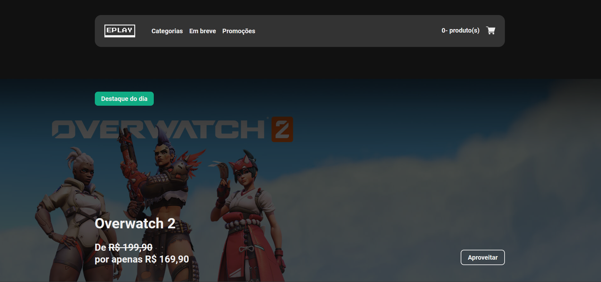

  

<h1 align="center">EPLAY - Loja de games online</h1>

<h1 align="center">
    <a href="https://eplay-one.vercel.app/">🔗 Site da EPLAY</a>
</h1>

🚀 Loja de games online feita no curso da EBAC com o professor Gian Souza.

Tabela de conteúdos
=================

 <a href="#-objetivo">Objetivo</a> •
 <a href="#-tecnologias">Tecnologias</a> • 
 <a href="#features">Features</a> • 
 <a href="#licenca">Licença</a> • 
 <a href="#autor">Autor</a>

<h4 align="center"> 
	✅ EPLAY 🚀 Projeto finalizado.  ✅
</h4>

### ✅ Objetivo

💡A ideia era fazer uma loja online de jogos para compra digital, toda a ideia foi criada pelos designers da EBAC e aplicada por mim na execução e criação do código com ajuda do profesor Gian Souza. A loja possui diversos jogos e seções e toda parte de pagamento e checkout também é funcional.

### 💻 Tecnologias

Lista de tecnologias utilizadas nesse projeto: 

•ReactJS
•Typescript
•Styled-Components
•Prettier
•React Router
•Formix
•Eslint
•API
•Redux Toolkit

### 💡Features

- [x] Escolha de produto.
- [x] Utilização do carrinho.
- [x] Verificação de formulário.
- [x] Integração com API.
- [x] Finalização e compra do produto.
